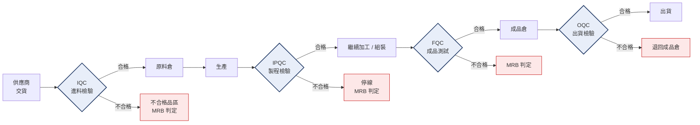

# 品質關卡全貌
{: .no_toc }

  
本頁目錄

  {: .text-delta }
- TOC
{:toc}

## 一張圖

料件從進廠到出貨,會被檢查四次。每一次的目的都不一樣。

## 四個關卡在擋什麼

### IQC — 進料檢驗

**擋的是:別人做壞的東西進到我們的產線。**

供應商交來的原物料、外購件、委外加工品。這一關擋不住,壞料會被投進生產,後面每一道工序都是在替錯誤加工時。

負責範圍:外觀、尺寸、材質證明、數量、包裝標示。

→ [第二章 · IQC 進料檢驗](../../iqc/)

### IPQC — 製程檢驗

**擋的是:生產過程中偏掉的東西繼續做下去。**

不是檢查「這一件好不好」,而是檢查「這條線現在還正不正常」。所以 IPQC 通常是**定時巡檢**,不是全檢。

典型動作:首件確認、每小時抽檢、換模/換料後重新確認、參數點檢。

{: .important }
IPQC 抓到問題時,重點不是那一件,是**上一次確認 OK 到現在之間做的全部**。
這段叫做「可疑批」,要一起管制。這是新人最常漏掉的一步。

### FQC — 成品測試

**擋的是:功能不符規格的成品進到成品倉。**

前面三關都是看「做得對不對」,這一關是看「**功能行不行**」。水錶的跑水測試就在這一關——外觀尺寸再漂亮,流量誤差超出限值就是不合格。

→ [第三章 · 成品測試](../../testing/)

### OQC — 出貨檢驗

**擋的是:出錯貨、包錯、標錯、文件沒附。**

FQC 已經確認過功能,OQC 主要看的是**這一批要出給這個客戶對不對**:型號、數量、包裝、標籤、出貨文件、客戶特殊要求。

OQC 抓到的問題常常不是品質問題,是**作業疏失**——貼錯標籤、少附證書、混批。但客訴裡這類佔的比例不低。

## 越晚發現越貴

同一個缺陷,在不同關卡被發現的代價:

| 發現的地方 | 付出的成本 | 誰承擔 |
|:--|:--|:--|
| IQC | 退料、換料的時間 | 供應商 |
| IPQC | 已投入的工時 + 停線 | 我們 |
| FQC | 整支重工或報廢 | 我們 |
| OQC | 重新挑選、重新包裝、延誤交期 | 我們 |
| 客戶端 | 退貨、賠償、8D、商譽、稽核 | 我們,而且是好幾倍 |

業界有個粗略的「10 倍法則」:每往後一關,處理成本大約放大十倍。數字不用當真,但**方向是對的**。

{: .important }
這就是品保存在的理由:**把錯誤攔在最便宜的地方**。
不是為了刁難產線,也不是為了「都放行反正後面會檢查」。

## 兩種新人最容易犯的極端

**極端一:什麼都放行。**
心態是「這只是一點點」「後面還會檢查」「產線在等」。結果是把成本往後推,而且一旦流出去,追溯範圍會變得非常大。

**極端二:什麼都擋。**
看到任何偏差就開單停線,但講不出依據是哪一條、超出多少、影響什麼。這樣的品保會很快失去信任,下次真的有問題時沒人理你。

正確的姿勢是第三種:**依據明確、判定一致、講得出理由**。

- 判合格 → 說得出符合哪一條標準、量測值多少。
- 判不合格 → 說得出超出哪一條、超出多少、屬於哪一類缺陷。
- 不確定 → **停下來問**,不要自己決定。標記「待判定」是完全正當的動作。

## 你應該要會

- [ ] 不看圖畫出四個關卡的順序
- [ ] 說出每一關擋的是什麼、擋不住的後果
- [ ] 解釋 IPQC 抓到問題時為什麼要管制「可疑批」
- [ ] 說明為什麼「不確定就先擋著問」比「先放行再說」正確
