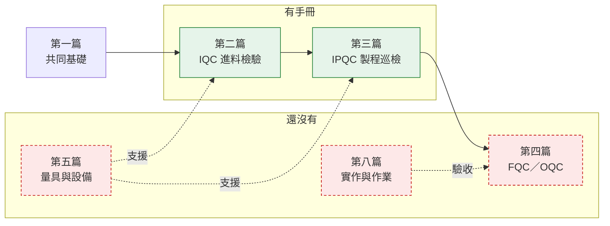

# 公司手冊

品檢組實際編製、實際在用的教育訓練文件。

這一區和前面的章節**性質不同**:前面是通用性的觀念教材,用示範數字寫成;
這裡是公司自己的版本,有課綱對應、有站別、有實際的表單與系統操作。

{: .warning }
兩邊若有出入,**以本區的文件為準**,並回報給教材維護者更新前面的章節。

## 文件

| 文件 | 版本 | 對應課綱 | 內容 |
|:--|:--|:--|:--|
| [品檢組教育訓練課綱](curriculum/) | 討論版 | 全部 | 八篇二十三單元的整體架構 |
| [進料檢驗新人教育手冊](iqc/) | 修訂版 10 | 第二篇 | 10 章 + 2 附錄,基本觀念到廠商巡檢 |
| [QC 製程巡檢教育手冊](ipqc/) | 第 1 版 | 第三篇(8–12 單元) | 5 章,巡檢基礎、範圍、內容、異常、SPC |
| [彙整資料與邏輯分析](analysis/) | 終稿 | 跨篇 | 4 單元,問題定義到邏輯分析 |

## 涵蓋度對照

課綱有八篇,目前**三篇有對應的手冊,五篇還沒有**。

| 篇別 | 主題 | 單元 | 現況 |
|:--|:--|:--|:--|
| 第一篇 | 品質檢驗共同基礎 | 1–3 | 部分——本站[第一章 · 基礎](../basics/)涵蓋觀念,無公司版手冊 |
| 第二篇 | 進料檢驗 IQC | 4–7 | **有手冊**——[進料檢驗新人教育手冊](iqc/) |
| 第三篇 | QC 製程巡檢 IPQC | 8–12 | **有手冊**——[QC 製程巡檢教育手冊](ipqc/) |
| 第四篇 | 最終成品檢驗 FQC／OQC | 13–16 | **缺**——本站[第三章 · 成品測試](../testing/)為通用版 |
| 第五篇 | 量具與檢驗設備 | 17–19 | **缺**——含卡尺外徑量測實作 |
| 第六篇 | 品質資料與常用品質手法 | 20 | 部分——散在進料檢驗手冊第 6 章 |
| 第七篇 | 公司系統與表單 | 21 | 部分——進料檢驗手冊第 9 章(公開版已移除截圖) |
| 第八篇 | 實作與課後作業 | 22–23 | **缺** |

## 和本站章節的對應

| 本站章節 | 公司文件 | 關係 |
|:--|:--|:--|
| [第一章 · 基礎](../basics/) | 課綱第一篇 | 觀念相同,公司版更具體 |
| [第二章 · IQC](../iqc/) | [進料檢驗新人教育手冊](iqc/) | **對照閱讀**,以手冊為準 |
| (本站無) | [QC 製程巡檢教育手冊](ipqc/) | **手冊補上本站缺的一關** |
| [第三章 · 成品測試](../testing/) | 課綱第四篇(無手冊) | 本站為通用版 |
| [第四章 · 不良品](../ncr/) | [彙整資料與邏輯分析](analysis/) | 分析方法互補 |

## 原檔

四份都保留了 Word 原檔,可直接下載列印:

- [品檢組教育訓練課綱_進料至最終成品_討論版.docx](files/品檢組教育訓練課綱_進料至最終成品_討論版.docx)
- [進料檢驗新人教育手冊_修訂版10.docx](files/進料檢驗新人教育手冊_修訂版10.docx)
- [QC製程巡檢教育手冊_第1版.docx](files/QC製程巡檢教育手冊_第1版.docx)
- [教育訓練_彙整資料與邏輯分析終稿.docx](files/教育訓練_彙整資料與邏輯分析終稿.docx)

網頁版由原檔自動轉換,**內容未經改寫**,只調整了排版以便閱讀與搜尋。

{: .warning }
進料檢驗手冊第 9 章原有 BPM / ESS / EMS 操作截圖,因含內部系統資訊與登入者姓名,
公開版已移除(網頁與 docx 皆是),該節改以文字說明。其餘內容完整。
