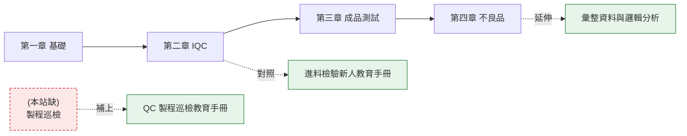

# 公司手冊

品檢組實際編製、實際在用的教育訓練手冊。

這一區和前面的章節**性質不同**:前面是通用性的觀念教材,用示範數字寫成;
這裡是公司自己的版本,有課綱對應、有站別、有實際的表單與系統操作。

{: .warning }
兩邊若有出入,**以本區的手冊為準**,並回報給教材維護者更新前面的章節。

## 手冊

| 手冊 | 版本 | 內容 |
|:--|:--|:--|
| [進料檢驗新人教育手冊](iqc/) | 修訂版 10 | 10 章 + 2 附錄,從基本觀念到廠商巡檢 |
| [QC 製程巡檢教育手冊](ipqc/) | 第 1 版 | 5 章,對應課綱第三篇第 8~12 單元 |
| [彙整資料與邏輯分析](analysis/) | 終稿 | 4 單元,問題定義、影響評估、故事導向、邏輯分析 |

## 和前面章節的對應

**本站原本缺了製程巡檢(IPQC)這一關**——只有進料、成品測試、不良品三塊。
第二份手冊補上了 IQC 與 FQC 之間的那一段。

## 原檔

三份都保留了 Word 原檔,可直接下載列印:

- [進料檢驗新人教育手冊_修訂版10.docx](files/進料檢驗新人教育手冊_修訂版10.docx)
- [QC製程巡檢教育手冊_第1版.docx](files/QC製程巡檢教育手冊_第1版.docx)
- [教育訓練_彙整資料與邏輯分析終稿.docx](files/教育訓練_彙整資料與邏輯分析終稿.docx)

網頁版由原檔自動轉換,**內容未經改寫**,只調整了排版以便閱讀與搜尋。
