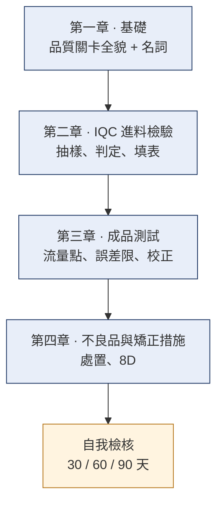

# 新進品保人員教育訓練
{: .no_toc }

從完全不懂到能獨立執行檢驗、做出判定、處理不合格品。
{: .fs-6 .fw-300 }

[從第一章開始](basics/){: .btn .btn-primary .fs-5 .mb-4 .mb-md-0 .mr-2 }
[名詞不懂先查這裡](basics/glossary/){: .btn .fs-5 .mb-4 .mb-md-0 .mr-2 }
[先讀:品保的進化史](history/){: .btn .fs-5 .mb-4 .mb-md-0 .mr-2 }
[動手玩:製程分布實驗室](lab/){: .btn .fs-5 .mb-4 .mb-md-0 }

---

## 這套教材要讓你會什麼

三個月後,你要能**獨立**做到這些事:

1. 一批料到廠,你知道要抽幾件、量哪些項目、允收幾件、退幾件。
2. 一支成品測完,你看得懂數據,並且知道它為什麼合格或不合格。
3. 遇到不合格品,你知道它接下來會走哪條路、要開什麼單、誰要簽。
4. 遇到**教材沒寫的例外**,你知道該問誰、該查哪份文件,而不是自己決定。

第 4 點最重要。品保最怕的不是不會,是**不確定卻自己判了**。

## 學習路徑

照順序讀。後面的章節假設你已經懂前面的名詞。

| 章節 | 內容 | 預計時數 |
|:--|:--|:--|
| [品保的進化史](history/) | 這些規定是怎麼來的 — 六個紀元、五句口號 | 40 分鐘 |
| [第一章 · 基礎](basics/) | 品質關卡全貌、名詞對照 | 2 小時 |
| [第二章 · IQC 進料檢驗](iqc/) | 流程、抽樣計畫、判定、檢驗表 | 6 小時 + 實作 |
| [第三章 · 成品測試](testing/) | 測試流程、誤差限、校正設定點 | 6 小時 + 實作 |
| [第四章 · 不良品與矯正措施](ncr/) | 不合格品處置、矯正措施與 8D | 4 小時 |
| [自我檢核](checklist/) | 帶人的人與新人共用的檢核表 | — |
| [公司手冊](handbook/) | 品檢組實際編製的四份文件(含課綱與製程巡檢) | 依手冊 |
| [製程分布實驗室](lab/) | 互動工具:貼上量測值,看分布形狀與推估不良率 | 隨用 |

## 怎麼用這份教材

**先看一下 [品保的進化史](history/)**。不是必讀,但看過之後,後面每一條規定你都會知道它是為了解決什麼問題才出現的——那比背下來有用得多。

**自學的人**:照章節順序讀,每章最後的「你應該要會」自己對一次。不會的先標起來,不要跳過。

{: .important }
[公司手冊](handbook/)那一區是品檢組**實際編製、實際在用**的版本,有課綱對應、有站別、有系統操作。
前面章節是通用觀念教材,兩邊有出入時**以公司手冊為準**。

**帶人的人**:每章對應一次帶做。教材負責講「為什麼」,你負責帶「實際怎麼做」——實機操作、實際表單、實際的例外案例。[自我檢核](checklist/) 那頁可以直接當帶人進度表。

## 這份教材的界線

{: .warning }
本教材是**通用性訓練內容**,用來建立觀念與判斷邏輯。
實際的抽樣水準、AQL 值、允收基準、表單版次、簽核層級,一律以**公司核發的最新管制文件**為準。
兩者不一致時,以管制文件為準,並回報給教材維護者更新。

教材裡的數字(批量、樣本數、誤差值、供應商名稱)全部是**示範用的假資料**,不要拿來當實際判定依據。
