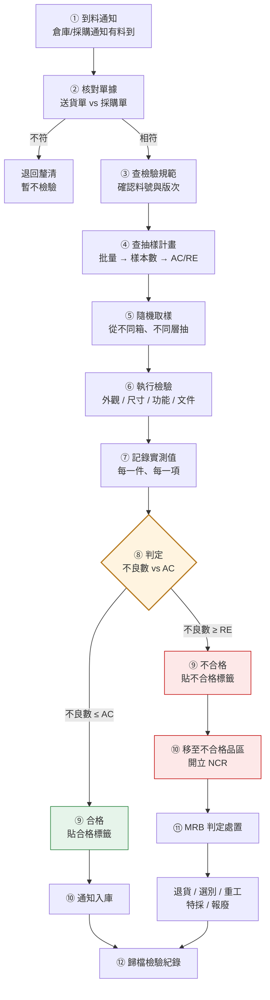

# IQC 檢驗流程
{: .no_toc }

  
本頁目錄

  {: .text-delta }
- TOC
{:toc}

## 流程圖

## 每一步在做什麼

### ① 到料通知

倉庫收貨後通知 IQC。**料還沒檢驗之前不能入庫、不能發料**,要停在待檢區。

{: .warning }
待檢區、合格區、不合格區必須**實體隔開並標示清楚**。
最常見的重大缺失就是「待檢的料被拿去用了」。標示不清就會發生。

### ② 核對單據

送貨單 × 採購單 × 實物,三者要對得起來:

- 料號、品名是否一致
- 數量是否相符(短交、超交都要記錄)
- 批號/製造日期有沒有標示
- 該附的文件有沒有附(材質證明、檢驗報告、校正證書)

對不起來就先**停在這裡**,不要開始檢驗。單據錯的料檢了也是白檢。

### ③ 查檢驗規範

依料號調出檢驗規範,確認:

- **版次是不是最新的**
- 要檢哪些項目
- 每一項的標準值與公差
- 用什麼量具、怎麼量

### ④ 查抽樣計畫

依批量查出樣本數與 AC/RE。→ [抽樣計畫](../sampling/)

### ⑤ 隨機取樣

**「隨機」是這一步的重點,不是「方便」。**

正確做法:
- 從**不同箱**抽,不是只開最上面那箱
- 同一箱從**不同層**抽,不是只拿表面那幾件
- 棧板要抽到不同位置

{: .warning }
只抽最上層、只開一箱,是 IQC 最常見也最嚴重的作業偏差。
供應商如果知道你只看表面,表面就會永遠是好的。

### ⑥ 執行檢驗

依規範逐項做。典型順序是**先不破壞、後破壞**:

1. **包裝與標示** — 外箱標示、數量、防護是否完整
2. **外觀** — 刮傷、變形、鏽蝕、毛邊、色差
3. **尺寸** — 卡尺、投影機、塞規等
4. **材質/文件** — 材質證明是否對應到這一批的爐號/批號
5. **功能** — 需要試裝、通電、氣密的項目
6. **破壞性測試** — 有的話放最後

### ⑦ 記錄實測值

{: .important }
**記錄「量到多少」,不要只記錄「OK / NG」。**

只寫 OK 的紀錄,事後完全無法分析。寫下實測值,你才能看出:
- 這個供應商是穩定地落在中間,還是一直貼著上限邊緣
- 有沒有隨時間漂移的趨勢

貼著公差邊緣但沒超出的料,規範上要判合格,但**要記錄並回饋**——這是下一次出問題的預兆。

### ⑧ 判定

把不良件數和 AC 比:

- 不良數 **≤ AC** → 整批允收
- 不良數 **≥ RE** → 整批拒收

→ 判定的細節與爭議情境看 [判定與填表](../judgement/)

### ⑨–⑩ 標示與移動

合格:貼合格標籤,通知入庫。
不合格:貼不合格標籤,移到**不合格品區**,開立 NCR。

標籤上至少要有:料號、批號、數量、檢驗日期、檢驗人、判定結果。

### ⑪ MRB 判定處置

不合格品不是你決定怎麼處理。你的工作是**把事實記錄清楚**,讓有權責的人判定。

→ [第四章 · 不良品與矯正措施](../../ncr/)

### ⑫ 歸檔

檢驗紀錄依規定保存年限歸檔。客訴追溯、稽核、供應商評鑑都會回來調。

## 特殊情境

### 緊急放行

產線真的等不到檢驗完成時,有些公司有「緊急放行」程序。重點:

- 必須有**書面申請與權責核准**,不是口頭
- 必須**可追溯**:這批料用到哪些成品上,要記錄
- 檢驗**照做**,只是順序調整;事後結果不合格時要能立刻攔截
- 這是例外程序,不是常態

{: .warning }
新人不要自行決定緊急放行,也不要在沒有書面核准前先讓料離開待檢區。

### 免驗料

有些低風險或長期表現良好的料件可能列為免驗。但:

- 免驗清單是**管制文件**,要有核准
- 免驗不等於不看——單據核對、數量、外觀目視通常還是要做
- 供應商一旦出問題,免驗資格要立即取消

### 分批到貨

同一張採購單分幾次到,**每一次到貨是一個獨立的批**,各自抽樣判定。不能第一次檢過就把後面幾次一起算合格。

## 你應該要會

- [ ] 不看流程圖說出完整的十二個步驟
- [ ] 說明為什麼單據對不起來時不該先開始檢驗
- [ ] 正確執行隨機取樣,說得出為什麼不能只抽最上層
- [ ] 解釋為什麼要記錄實測值而不是只寫 OK
- [ ] 說出待檢/合格/不合格三區為什麼要實體隔離
