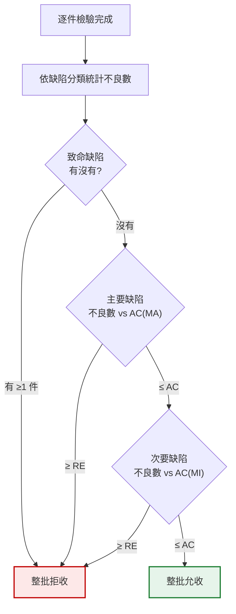

# 判定與填表
{: .no_toc }

  
本頁目錄

  {: .text-delta }
- TOC
{:toc}

## 判定的邏輯

{: .important }
**各分類分開判,任何一類拒收就是整批拒收。**
不能把次要缺陷「折抵」成主要缺陷,也不能加總在一起算。

## 一件有多個缺陷怎麼算

一件產品同時有刮傷(MI)和尺寸超差(MA):

- 在 **MA** 這一類算 **1 件不良**
- 在 **MI** 這一類算 **1 件不良**
- 但**「不良品件數」只算 1 件**(算不良率時不能重複計)

實務上記錄要寫清楚:「第 7 件:尺寸 25.14(超上限)、右側刮傷 3mm」。

## 邊緣值怎麼判

規格 25.0 ± 0.1(即 24.9 ~ 25.1),量到 **25.10**:

**在規格內,判合格。** 邊界值屬於合格範圍。

但要做兩件事:

1. **記錄實測值**,不要只寫 OK
2. **回饋**——連續幾批都貼著上限,代表供應商的製程中心偏了,下一批很可能就超出

{: .important }
「還在規格內但一直貼邊」是**預警訊號**,不是「沒事」。
品保的價值不只在攔下已經壞掉的,更在看出**正在變壞的趨勢**。

### 量到 25.11 呢?

超出就是超出,判不良。不要因為「只差 0.01」就放行。

但要先問一個問題:**你的量具能分辨 0.01 嗎?**

- 如果量具解析度是 0.01 mm、不確定度是 ±0.02 mm,那 25.11 和 25.10 在量測上其實**分不出來**
- 這時正確的做法是**複量**:換人量、換量具量、多量幾個位置

複量之後仍然超出 → 判不良。複量結果不一致 → 這是量測系統的問題,要往上反映。

{: .warning }
**不要用「只差一點點」當放行理由,也不要用「量到就是超出」當唯一依據。**
先確認量測本身可信,再談判定。

## 檢驗表怎麼填

一份能用的檢驗紀錄,要能在**三個月後**回答所有問題。

### 表頭:這批是什麼

| 欄位 | 為什麼要 |
|:--|:--|
| 檢驗日期 | 追溯時間軸 |
| 料號 / 品名 | 確認檢的是哪個東西 |
| 供應商 | 供應商評鑑要統計 |
| 批號 / 製造日期 | 客訴時往上追到供應商的生產批 |
| 進料數量(批量 N) | 抽樣計畫的輸入 |
| 採購單號 / 送貨單號 | 單據勾稽 |
| **依據規範版次** | **沒寫版次的紀錄,事後無法證明判定基準** |

### 抽樣資訊

| 欄位 | 說明 |
|:--|:--|
| 檢驗水準 | 一般水準 II 或其他 |
| AQL | 各缺陷分類分別填 |
| 樣本數 n | 由批量查表得出 |
| AC / RE | 由 n + AQL 查表得出 |

{: .note }
這幾欄通常可以由「進料數量」自動帶出來——批量決定樣本數,樣本數加 AQL 決定 AC/RE。
如果你們的表單是 Excel,這段可以做成公式,少一個手抄出錯的機會。

### 檢驗項目:記數字,不要只記 OK

**不好的寫法:**

| 項目 | 判定 |
|:--|:--|
| 外徑 | OK |
| 螺紋 | OK |

**好的寫法:**

| 項目 | 規格 | 量具 | #1 | #2 | #3 | … | 判定 |
|:--|:--|:--|--:|--:|--:|:--|:--|
| 外徑 (mm) | 25.0±0.1 | 卡尺 | 25.02 | 24.98 | 25.05 | … | 合格 |
| 螺紋 | 通/止規 | 螺紋規 | 通 | 通 | 通 | … | 合格 |
| 外觀 | 無刮傷變形 | 目視 | OK | OK | 刮傷 | … | 1 件 MI |

差別在於:好的寫法三個月後還能拿來做趨勢分析,壞的寫法只能證明「有人簽過名」。

### 判定與簽核

| 欄位 | 說明 |
|:--|:--|
| 各分類不良數 | CR / MA / MI 分開 |
| 判定結果 | 合格 / 不合格 |
| 不合格說明 | 哪一項、超出多少、幾件 |
| 檢驗人 | 誰做的 |
| 覆核 / 主管 | 依權責 |

## 填表常見錯誤

**沒填規範版次。** 事後無法證明當時依據的標準是什麼。

**只寫 OK。** 失去所有分析價值。

**判定和數據矛盾。** 量測欄寫了 25.14(超出 25.1),判定欄卻寫合格。稽核一定會抓到,而且很難解釋。

**空白欄位。** 沒檢的項目要寫「N/A」並註明原因,不要留白。留白無法分辨是「沒做」還是「忘了寫」。

**塗改沒有簽名。** 紀錄要修改,正確做法是**劃單線槓掉、寫上正確值、簽名並註明日期**。不要用立可白,不要整格塗黑。

{: .warning }
**不要事後補寫紀錄。**
檢驗當下就記錄。事後憑印象補,數字會失真,而且在稽核上屬於重大缺失。

## 你應該要會

- [ ] 說出各缺陷分類為什麼要分開判、不能互相折抵
- [ ] 處理「一件有多個缺陷」的計數
- [ ] 處理邊緣值:判定 + 記錄 + 回饋趨勢
- [ ] 遇到「只超出一點點」時,先確認量測系統再判定
- [ ] 完成一份無缺漏的檢驗表,包含規範版次與實測值
- [ ] 正確修改紀錄(劃線、簽名、註明日期)
