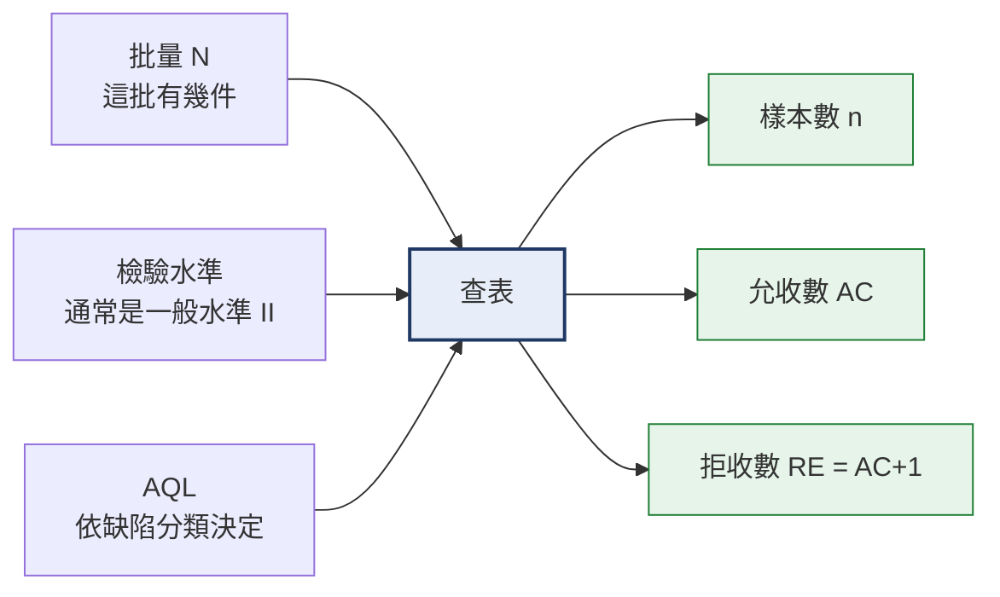
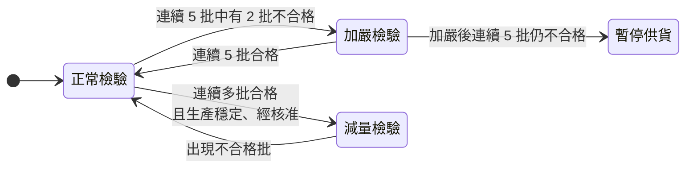

# 抽樣計畫
{: .no_toc }

  
本頁目錄

  {: .text-delta }
- TOC
{:toc}

## 為什麼不全檢

三個理由:

1. **成本**:一批 5000 件全檢要好幾天,產線等不了。
2. **破壞性**:有些測試做完那件就毀了,全檢等於全報廢。
3. **全檢也不是 100% 準**。人工全檢的漏檢率通常在 5–15%——看久了會累、會習慣、會恍神。**全檢反而可能比嚴謹的抽樣還不可靠。**

所以做法是:**抽一部分,用統計方法推論整批**。

{: .important }
抽樣的本質是**風險管理**,不是「檢查一部分就好」。
它承認會有漏網之魚,但把「壞批被誤放行」的機率控制在可接受的範圍。

## 抽樣的三個輸入

### 批量(N)

這一批總共幾件。**不是採購單總量**,是這一次到貨、要一起判定的數量。

分批到貨就分批判定。

### 檢驗水準

決定抽樣的嚴格程度:

| 水準 | 什麼時候用 |
|:--|:--|
| 一般水準 I | 檢驗成本高、風險低的料 |
| **一般水準 II** | **預設值。大部分料件用這個** |
| 一般水準 III | 關鍵件、新供應商、近期出過問題 |
| 特殊水準 S-1 ~ S-4 | 破壞性測試、單價極高、檢驗極耗時 |

### AQL

**允收品質界限**——可以接受的不良率上限。數字越小越嚴格。

依缺陷分類給不同的 AQL:

| 缺陷分類 | 典型 AQL | 意思 |
|:--|:--|:--|
| CR 致命 | 0 | 一件都不能有 |
| MA 主要 | 0.65 ~ 1.0 | 約 1% 以內可接受 |
| MI 次要 | 2.5 ~ 4.0 | 較寬鬆 |

{: .warning }
上面的數字是**業界常見範圍的示意**。
你們公司實際用的 AQL 一定要查**核發的抽樣計畫管制文件**,不要用這裡的數字。

## 查表流程

以 ISO 2859-1(等同 CNS 2779、ANSI/ASQ Z1.4)為例,分兩步:

### 第一步:批量 → 樣本代字

一般檢驗水準 II:

| 批量 N | 代字 | 樣本數 n |
|:--|:--:|--:|
| 2 – 8 | A | 2 |
| 9 – 15 | B | 3 |
| 16 – 25 | C | 5 |
| 26 – 50 | D | 8 |
| 51 – 90 | E | 13 |
| 91 – 150 | F | 20 |
| 151 – 280 | G | 32 |
| 281 – 500 | H | 50 |
| 501 – 1200 | J | 80 |
| 1201 – 3200 | K | 125 |
| 3201 – 10000 | L | 200 |
| 10001 – 35000 | M | 315 |
| 35001 – 150000 | N | 500 |

### 第二步:樣本數 + AQL → AC / RE

正常檢驗、單次抽樣,AQL 1.0 那一欄:

| 樣本數 n | AC | RE |
|--:|--:|--:|
| 13 | 0 | 1 |
| 20 | 0 | 1 |
| 32 | 1 | 2 |
| 50 | 1 | 2 |
| 80 | 2 | 3 |
| 125 | 3 | 4 |
| 200 | 5 | 6 |
| 315 | 7 | 8 |
| 500 | 10 | 11 |

{: .note }
表上有時會看到 **↓ 或 ↑ 箭頭**,意思是「這個組合沒有對應的計畫,改用箭頭方向的第一個計畫」,
樣本數要跟著換成該列的數字。小批量配嚴格 AQL 時很常遇到。

{: .example }
**範例**:一批 800 件,主要缺陷 AQL 1.0,一般水準 II。
批量 501–1200 → 代字 **J** → 樣本數 **n = 80**。
n=80 配 AQL 1.0 → **AC = 2、RE = 3**。
→ 抽 80 件,不良 **0~2 件允收**,**3 件以上拒收**。

## 正常 / 加嚴 / 減量

抽樣不是固定的,會依供應商表現轉換:

- **加嚴檢驗**:樣本數不變,但 AC 變小(更難過)
- **減量檢驗**:樣本數變少
- **加嚴到一定程度仍不合格 → 停止驗收**,由採購/品保與供應商協商

{: .important }
轉換規則是**制度**,不是你當天心情。
要轉換必須依程序書、要有紀錄。新人不要自行決定「這家最近不錯,抽少一點」。

## 常見錯誤

**把 AC 當成「可以有幾件壞的」。**
AC 是**這個抽樣計畫的判定門檻**,不是「允許不良品存在」。判定允收之後整批進廠,不是把那 2 件挑掉而已。

**批量算錯。**
用採購單總量而不是這次到貨量,樣本數就會抽錯。

**AQL 選錯欄。**
致命缺陷用了次要缺陷的 AQL,等於漏掉最該擋的東西。**同一次檢驗,不同缺陷分類要各自判定**。

**用「差不多」的批量查表。**
1200 件和 1201 件分屬不同代字(J 和 K),樣本數從 80 跳到 125。邊界值要看清楚。

**抽樣不隨機。**
統計推論的前提是「樣本能代表整批」。只抽最上層的話,前面所有計算都失去意義。

## 你應該要會

- [ ] 說出為什麼不全檢,以及全檢為什麼也不是 100% 可靠
- [ ] 給定批量與 AQL,查出樣本數與 AC/RE
- [ ] 解釋 AC 和 RE 的關係,以及 AC 不等於「允許幾件不良」
- [ ] 說明不同缺陷分類為什麼要用不同 AQL、各自判定
- [ ] 說出正常/加嚴/減量的轉換時機,以及為什麼不能自己決定
