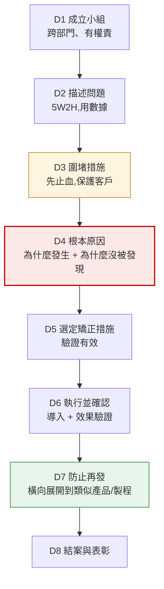

# 矯正措施與 8D
{: .no_toc }

  
本頁目錄

  {: .text-delta }
- TOC
{:toc}

## 處置解決不了根因

處置處理的是**手上這批**。矯正措施處理的是**為什麼會發生**。

{: .important }
判斷標準很簡單:**做完這件事,同樣的問題還會不會再發生?**
會 → 那只是處置。
不會 → 那才是矯正措施。

| 動作 | 是哪一種 |
|:--|:--|
| 把不良品挑掉 | 處置 |
| 這批退回供應商 | 處置 |
| 加強檢驗、改成全檢 | **還是處置**(只是把網子加密,沒解決源頭) |
| 供應商更換磨損的模具 | 接近矯正,但要問「為什麼磨損到這程度才發現」 |
| 供應商建立模具壽命管制與定期更換 | **矯正措施** |

{: .warning }
**「加強教育訓練」和「加強檢驗」是最常見的假矯正措施。**
如果一份 8D 的根本原因寫「作業員疏忽」、矯正措施寫「加強教育訓練」,
那基本上等於沒做——人一定會再疏忽一次。
真正的矯正是讓**疏忽了也不會出錯**(防呆、自動檢出、流程改變)。

## 什麼時候要開 CAR

不是每個不合格都要開。常見的觸發條件:

- 同一問題**重複發生**
- 造成**停線、客訴或重大損失**
- **安全或法規**相關
- 不良率超過約定門檻
- 系統性問題(不是單一個案)

單次、輕微、明確是偶發的個案,通常處置完就結案並記錄,累積到一定次數再開。

## 8D 八個步驟

8D 是一套結構化的問題解決格式。要求供應商回覆矯正措施時,通常就是要一份 8D。

### 各步驟的重點

**D1 成立小組** — 要有能實際改變製程的人,不能只有業務。

**D2 描述問題** — 用**數據**描述,不是形容詞。
「外觀不良」不行,「批號 X 共 500 件,抽驗 80 件中 6 件表面有長度 2–5 mm 之刮痕,位於法蘭面」才可以。

**D3 圍堵措施** — 先止血。已出貨的怎麼辦?在製的怎麼辦?庫存的怎麼辦?
**圍堵要涵蓋三個地方:客戶端、在途/庫存、生產中。**

{: .important }
D3 是**時效最急**的一步。要求供應商 24 小時內回覆 D1–D3,
D4 以後可以給比較長的時間。圍堵拖延的代價最高。

**D4 根本原因** — 8D 的核心,也是最常做假的一步。

必須回答**兩個**問題:

| 問題 | 在問什麼 |
|:--|:--|
| **為什麼會發生?** | 製造端的根因 |
| **為什麼沒被發現?** | **檢出端的根因** |

{: .warning }
只回答第一個問題的 8D 是不完整的。
東西做壞了是一個問題,做壞了還流到客戶手上是**另一個問題**,
代表檢驗系統也有漏洞。兩個都要矯正。

**D5 / D6 選定並執行矯正措施** — 要能**驗證有效**。怎麼證明改了以後真的好了?通常要提供改善後的數據。

**D7 防止再發 / 橫向展開** — 這是 8D 真正的價值。

同樣的失效模式,是不是也可能發生在:
- 其他料號?
- 其他產線?
- 其他相似結構的產品?

{: .important }
**橫向展開沒做,同樣的問題會在隔壁產品重演一次。**
新人審 8D 時,D7 是最值得追問的一欄。

**D8 結案** — 確認效果維持一段時間後才結案。

## 5 Why:怎麼問到根因

D4 常用的工具。重點不是問滿五次,是**每一次的答案都要是上一次的原因**。

{: .example }
**問題:水錶法蘭面有刮痕。**
1. 為什麼有刮痕? → 搬運過程中互相碰撞
2. 為什麼會碰撞? → 週轉箱沒有隔板,產品直接堆疊
3. 為什麼沒有隔板? → 原本的隔板破損後沒有補充
4. 為什麼沒有補充? → **週轉箱耗材沒有納入定期點檢項目**
5. 為什麼沒納入? → 包裝耗材的維護沒有明確權責單位

→ 矯正措施:把週轉箱與隔板納入定期點檢,並指定權責單位。
→ 如果只停在第 1 層,措施會變成「請作業員小心搬運」——沒有用。

### 檢查 5 Why 有沒有做假

- 答案有沒有**跳躍**?(第 3 層跟第 2 層接不起來)
- 有沒有停在「**人為疏忽**」就不往下問了?
- 反過來念得通嗎?(因為 5,所以 4;因為 4,所以 3……)
- 最後的措施是不是**改變了系統**,而不只是提醒人?

## 怎麼看一份 8D 有沒有誠意

審 8D 時的檢查清單:

- [ ] D2 有**數據**,不是形容詞
- [ ] D3 圍堵涵蓋**客戶端 + 在途庫存 + 生產中**三處
- [ ] D4 同時回答「**為什麼發生**」和「**為什麼沒被發現**」
- [ ] D4 沒有停在「作業員疏忽」
- [ ] D5/D6 有**驗證數據**,不只是「已改善」
- [ ] D7 有**橫向展開**到其他料號/產線
- [ ] 措施是**改變系統**,不是「加強注意」
- [ ] 有明確的**負責人與完成日期**

不合格的 8D 要退回要求補正,不要為了結案而接受。

{: .warning }
接受一份沒有根因的 8D,等於承諾這個問題半年後會再回來一次,
而且下次你會很難解釋為什麼上次就結案了。

## 你應該要會

- [ ] 用「還會不會再發生」區分處置與矯正措施
- [ ] 說出「加強檢驗」「加強教育訓練」為什麼通常不算矯正措施
- [ ] 說出 8D 八個步驟,並說明 D3、D4、D7 各自的重點
- [ ] 說明 D4 為什麼要回答兩個「為什麼」
- [ ] 用 5 Why 追問到系統層級的根因,而不是停在人為疏忽
- [ ] 依檢查清單審一份 8D,判斷該不該接受
