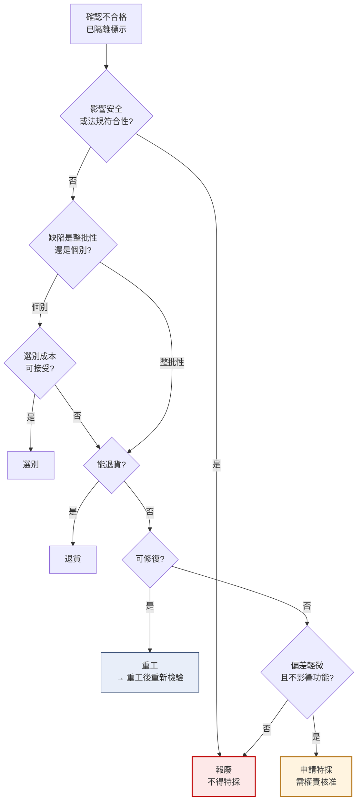

# 不合格品處置
{: .no_toc }

  
本頁目錄

  {: .text-delta }
- TOC
{:toc}

## 五種處置方式

| 處置 | 做什麼 | 什麼時候用 |
|:--|:--|:--|
| **退貨** | 整批退回供應商 | 進料不合格,且供應商能重新供應 |
| **選別** | 全數挑選,好的留下、壞的挑掉 | 不良是**個別**的,不是整批性的 |
| **重工** | 修整到符合規格 | 缺陷可修復,且修復後不影響其他特性 |
| **特採** | 明知不符規格,經核准後仍使用 | 偏差輕微、不影響安全與功能、有時效壓力 |
| **報廢** | 判定無法使用,銷毀 | 無法修復,或修復成本高於價值 |

## 決策邏輯

{: .warning }
**第一個問題永遠是「有沒有影響安全或法規」。**
計量誤差超出法定 MPE、安規項目不符、材質不符法規要求——
這幾類**沒有特採這個選項**,不管交期多急、不管誰來要求。

## 各處置的注意事項

### 退貨

- 退回的數量、批號要記錄,並與供應商確認收到
- **退貨不等於結案**——還要看是否需要開 CAR 要求矯正
- 供應商重新供應的批次,通常要**加嚴檢驗**

### 選別

- 誰選別?我們選(算成本)還是供應商來選(通常應該)
- 選別後的**良品要重新檢驗**,不是選完就直接入庫
- 選別出來的不良品要另外隔離處置,不要混回去

{: .warning }
選別最常見的漏洞:**選完的良品沒有重新標示**,結果和未選別的混在一起。
選別後一定要換新標籤,註明「已選別」與選別日期。

### 重工

- 重工方案要有**核准**,不是現場自己想辦法修
- 重工後**必須重新檢驗**,而且要檢驗重工可能影響到的**所有**特性
- 重工紀錄要保留——這批東西的履歷跟正常品不一樣

{: .important }
重工要問一個問題:**修了這個,會不會弄壞別的?**
例如重新攻牙修正螺紋,可能影響同軸度;加熱矯正變形,可能影響材質特性。

### 特採

**這是最需要謹慎的一種,也是新人最容易誤解的一種。**

特採的正確定義:**明知不符規格,但經過評估與權責核准,決定在特定範圍內接受使用。**

必要條件:

| 條件 | 說明 |
|:--|:--|
| 書面申請 | 寫清楚偏差項目、偏差量、影響評估 |
| 影響評估 | 對功能、壽命、安全、法規的影響 |
| 權責核准 | 依偏差程度決定核准層級,通常需品保 + 工程 + 主管 |
| **範圍限定** | **只限這一批、這個數量、這個偏差** |
| 客戶同意 | 若涉及客戶規格,需客戶書面同意 |
| 追溯記錄 | 這批用到哪些成品要能查得到 |

{: .warning }
**特採不會延續到下一批。**
「上次這樣也過了」不是理由——上次是針對上次那一批的個案核准。
新人聽到這句話時,正確的回應是「那是上一批的特採,這批要重新申請」。

{: .warning }
**特採次數要統計。**
同一個項目一直特採,代表規格訂錯了或供應商能力不足。
兩者都要處理:要嘛修改規格(正式改版),要嘛要求供應商改善。
**用特採長期掩蓋問題,是稽核上的重大缺失。**

### 報廢

- 報廢要有核准,並記錄數量與價值
- **實體銷毀或明確標示**,避免被誤取使用
- 報廢品不能流入二手市場或當作良品處理

{: .warning }
報廢品必須**確實破壞或隔離管制**。
「先放在角落」的報廢品被誤用,是很常見的重大事故來源。

## MRB:誰決定

**不合格品的處置由 MRB(材料審查)決定,不是檢驗員。**

典型組成:品保 + 工程/研發 + 生產 + 採購(進料類)。依偏差程度可能還要更高層級。

你的角色是**提供事實**:

- 不合格項目與實測值
- 不良數量與比例
- 依據的規範與版次
- 初步觀察(標明是推測)

{: .important }
被問到「這樣可不可以用」時,新人正確的回答是:
**「量到的是 XX,規範是 YY,超出 ZZ。可不可以用要 MRB 判定。」**
陳述事實,不要替 MRB 做決定,也不要說「應該還好吧」。

## 你應該要會

- [ ] 說出五種處置方式及各自適用時機
- [ ] 說明哪些情況**絕對不能**特採
- [ ] 說出特採的必要條件,以及為什麼不能延續到下一批
- [ ] 說明選別後為什麼要重新檢驗與重新標示
- [ ] 說明重工後為什麼要檢驗「重工可能影響到的所有特性」
- [ ] 被問「可不可以用」時,正確地陳述事實而不做判定
