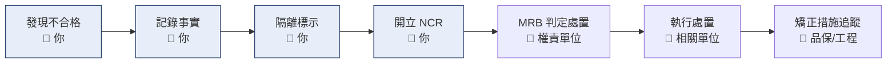

# 第四章 · 不良品與矯正措施

**目的:不合格品不會流出去,而且同樣的問題不會再發生一次。**

這兩件事是分開的:

| | 在處理什麼 | 回答的問題 |
|:--|:--|:--|
| **處置(Disposition)** | 手上這批東西 | 「這批怎麼辦?」 |
| **矯正措施(Corrective Action)** | 為什麼會發生 | 「怎麼讓它不再發生?」 |

{: .warning }
**只做處置不做矯正,問題一定會再來。**
把不良品退回去、重工掉、報廢掉,問題「消失」了——但造成它的原因還在。
下個月同樣的事會再發生一次,而且你會發現去年也發生過。

## 本章內容

| 單元 | 你會得到什麼 |
|:--|:--|
| [不合格品處置](disposition/) | 五種處置方式、決策邏輯、誰有權決定 |
| [矯正措施與 8D](car/) | 根因分析、8D 八個步驟、怎麼判斷回覆有沒有誠意 |

## 新人在這一章的角色

**你的工作是「把事實記錄清楚」,不是「決定怎麼處理」。**

前四步是你的責任,做確實了,後面的人才有辦法判斷。

### 「記錄事實」是什麼意思

**事實**:量到的數字、幾件、哪個位置、什麼時候發現、依據哪一版規範。

**不是事實**:「應該是供應商模具磨損」「上次也是這樣」「我覺得還可以用」。

{: .important }
推測可以寫,但要**標明是推測**,而且要放在「初步觀察」而不是「檢驗結果」。
把推測寫成事實,會誤導後面所有人的判斷。

### 立刻要做的三件事

發現不合格品時,順序不能錯:

1. **隔離** — 立刻移到不合格品區,或就地標示禁用。**不要先去問人再隔離**,那段時間料可能就被領走了。
2. **標示** — 貼不合格標籤,寫清楚料號、批號、數量、不合格原因、日期、發現人。
3. **通報** — 開立 NCR,通知相關單位。

{: .warning }
最嚴重的失誤不是判錯,是**不合格品沒有被隔離而流入生產**。
判錯還可以補救,流出去之後的追溯成本是幾十倍。

## 你應該要會

- [ ] 分清楚「處置」和「矯正措施」是兩件不同的事
- [ ] 說出發現不合格品時立刻要做的三件事及順序
- [ ] 區分「事實」與「推測」,並知道各自該寫在哪
- [ ] 說出五種處置方式,以及哪些不是你能決定的
- [ ] 看懂一份 8D 回覆,判斷它有沒有真的找到根因
