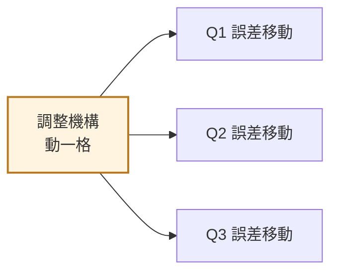
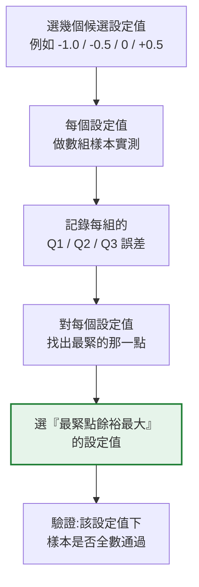

# 校正設定點
{: .no_toc }

  
本頁目錄

  {: .text-delta }
- TOC
{:toc}

這是第三章最需要動腦的一頁。前面兩頁是「怎麼測、怎麼判」,這一頁是「**怎麼讓產品一開始就做得好**」。

## 問題:調一個點,全部都會動

成品在出廠前會做一次調整,讓計量誤差落在合適的位置。但流量計的調整**不是每個點各調各的**——調整機構(調節環、旁通、齒比等)動一次,**所有流量點的誤差會一起移動**。

而且**移動的幅度不一樣**——各點的靈敏度不同。

所以問題變成:**我要把哪一個點對準?對準到多少?**

## 為什麼要選一個「設定點」

因為不可能三個點同時都調到零。必須選一個當基準,其他點跟著跑到哪算哪(只要都在限內)。

選 **Q3** 當設定點的理由通常是:

1. **它是規格上的參考流量**,也是實際使用中佔比高的區間
2. **它的量測最穩定**——大流量下試驗台的重複性最好,設定基準要用最可信的數字
3. 從 Q3 調整對其他點的影響**比較可預測**

{: .note }
不同產品結構、不同調整機構,適合的設定點不見得一樣。
重點不是「一定選 Q3」,而是**理解為什麼要選一個、以及選的依據是什麼**。

## 為什麼設定點不設在 0.00%

直覺會想「當然設在零最準」。但實務上通常會**刻意偏一點點**。

原因:**三個點的餘裕不對稱。**

假設把 Q3 設成 0.00%,結果其他點跑成:

| 點 | 誤差 | 限值 | 餘裕 |
|:--|--:|:--|--:|
| Q1 | −3.2% | ±5% | 1.8% |
| Q2 | **−1.7%** | ±2% | **0.3%** ← 最緊 |
| Q3 | 0.0% | ±2% | 2.0% |

Q2 只剩 0.3% 的餘裕。這代表:

- 製造變異稍微大一點,Q2 就掉出去
- 量測不確定度算進去,可能已經超出
- 使用一段時間後性能衰減,Q2 最先不合格

這時把設定點**往正的方向偏一點**,整組曲線一起上移,Q2 的餘裕就變大了。

{: .important }
**設定點要選在「讓最緊的那個點餘裕最大」的位置,不是選在零。**
這是最佳化問題:目標不是任一點準,是**整組通過的機率最高**。

## 怎麼找最佳設定點

方法是**掃描**:用不同的設定值各做幾組樣本,看哪個設定值下三個點的餘裕最平衡。

### 判讀的重點

**看「最小餘裕」,不看「平均誤差」。**

| 設定值 | Q1 餘裕 | Q2 餘裕 | Q3 餘裕 | **最小餘裕** |
|:--|--:|--:|--:|--:|
| −1.0% | 2.5% | 0.1% | 1.0% | **0.1%** |
| −0.5% | 2.2% | 0.8% | 1.5% | **0.8%** ← 最好 |
| 0.0% | 1.8% | 0.3% | 2.0% | **0.3%** |

上表是**示範用的假數字**。實際值要用你們的產品實測。

判準是**最小餘裕最大化**——因為整支表的通過與否,由最弱的那一點決定。

{: .example }
這種「看最弱環節,不看平均」的思路在品質工程裡到處都是:
一條產線的產能由最慢的工站決定,一批料的判定由最嚴的缺陷分類決定,
一支表的合格由餘裕最少的流量點決定。

### 上限和下限可能卡在不同的點

一個常見的結果是:

- **往正的方向調** → 先卡到某一點的**上限**
- **往負的方向調** → 先卡到另一點的**下限**

兩邊卡的不是同一個點。這時可用的設定範圍就被夾在中間,**最佳值就在這個窗口的中央附近**——離兩邊都最遠。

{: .important }
所以找設定點的實質工作是:**找出那個「可行窗口」的上下界,然後取中間。**
不是找哪個設定值讓某一點最準。

## 產品設計端的意義

如果掃描過所有設定值,**最小餘裕都很小**(例如都不到 0.3%),那代表:

**這不是校正能解決的問題,是設計或製程能力不足。**

這時該做的是回饋給工程單位:
- 零件公差是不是太寬
- 組裝一致性是不是不夠
- 結構本身在某個流量點的性能是不是先天不足

{: .warning }
**不要用「調整」去補「能力不足」。**
勉強調到剛好通過的產品,出廠時貼著限值,使用一段時間就會不合格,
變成保固退貨。校正是微調,不是補救。

## 你應該要會

- [ ] 說明為什麼調整一個點會影響所有流量點
- [ ] 解釋為什麼要選一個設定點,以及選 Q3 的理由
- [ ] 解釋為什麼設定點通常不設在 0.00%
- [ ] 用「最小餘裕最大化」判讀掃描結果,而不是看平均誤差
- [ ] 說明「上限卡在某點、下限卡在另一點」時,最佳值為什麼在中間
- [ ] 判斷什麼情況下該回饋設計端,而不是繼續調整
