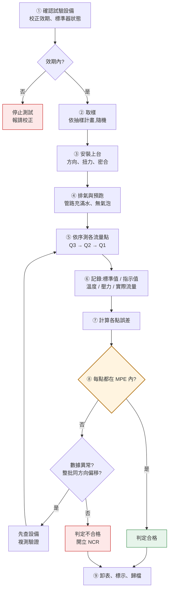
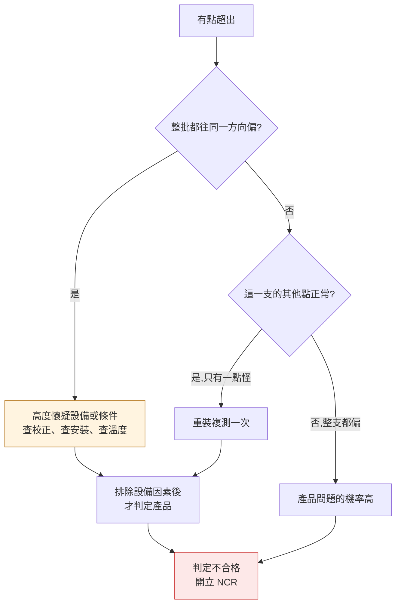

# 測試流程
{: .no_toc }

  
本頁目錄

  {: .text-delta }
- TOC
{:toc}

## 流程圖

## 每一步在做什麼

### ① 確認試驗設備

**每天開始測試前的第一件事。**

- 標準器**校正效期**在不在有效期內
- 校正證書上的修正值有沒有正確帶入
- 試驗台有無洩漏、閥件是否正常
- 溫度、壓力量測是否正常

{: .warning }
**校正過期的設備測出來的數據,全部無效。**
不是「應該還準吧」——過期就是不能用。而且如果過期期間已經測過並放行了產品,
那些批次全部要**重新評估**,這是很嚴重的事件。

### ② 取樣

依抽樣計畫,從整批中隨機抽。→ [抽樣計畫](../../iqc/sampling/)

不要只抽產線最後幾支、不要挑「看起來組得比較漂亮的」。

### ③ 安裝上台

- **安裝方向**要正確(表殼上有流向箭頭)
- 鎖固**扭力**依規定,太鬆會漏、太緊會變形影響計量
- 前後直管段長度要符合規定——**擾流會直接影響讀值**

{: .important }
安裝不當造成的誤差,會被誤判成產品不良。
一支表在台上測是 -3%,拆下來重裝再測變 -0.5%,問題在安裝不在產品。
**異常時先重裝複測**,這是最便宜的驗證。

### ④ 排氣與預跑

管路裡有空氣的話,標準器和表看到的體積不一致,誤差會亂跳。

- 開閥讓水充滿整個管路
- 確認排氣完成、無氣泡
- 先以較大流量跑一段時間,讓軸承潤滑、狀態穩定

**這步偷懶,後面的數據全部不可信。** 尤其是低流量點,對氣泡極度敏感。

### ⑤ 依序測各流量點

一般由**大到小**:Q3 → Q2 → Q1。

理由:大流量先跑可以讓表和管路狀態穩定,而且小流量點需要較長的時間累積足夠的體積,放後面比較有效率。

每一點都要:
- 讓流量**穩定**後才開始計量
- 累積足夠的體積(太少的話,起停誤差佔比太大)
- 起停要乾淨,避免計入暫態

### ⑥ 記錄

{: .important }
不要只記誤差百分比。**要記原始數據**:標準器讀值、表指示值、實際流量、水溫、壓力。

只記「-1.2%」的話,事後發現算法有誤或要重新分析時,什麼都救不回來。
原始值留著,誤差隨時可以重算。

### ⑦ 計算誤差

$$
E(\%) = \frac{V_{\text{表指示}} - V_{\text{標準}}}{V_{\text{標準}}} \times 100\%
$$

→ [流量點與誤差限](../mpe/)

### ⑧ 判定與異常處理

每一點分別和該點的 MPE 比較,**任一點超出即不合格**。

但在判不合格之前,先問:

{: .warning }
**「整批往同一方向偏」幾乎都不是產品問題。**
十支表不會約好一起偏 -3%。這種模式先查:標準器修正值有沒有帶錯、
試驗台有無洩漏、水溫是否異常、程式的計算公式有沒有被改過。

### ⑨ 卸表、標示、歸檔

合格品貼標示入庫;不合格品移到不合格品區,開立 NCR。原始紀錄歸檔。

## 你應該要會

- [ ] 說出測試前必須確認的設備狀態,以及校正過期的後果
- [ ] 正確安裝(方向、扭力、直管段)並說明為什麼重要
- [ ] 說明排氣與預跑的目的
- [ ] 說出為什麼測試順序由大流量到小流量
- [ ] 記錄原始數據而非只記誤差百分比
- [ ] 遇到異常時,依「整批同向偏移 → 查設備」的邏輯排查
