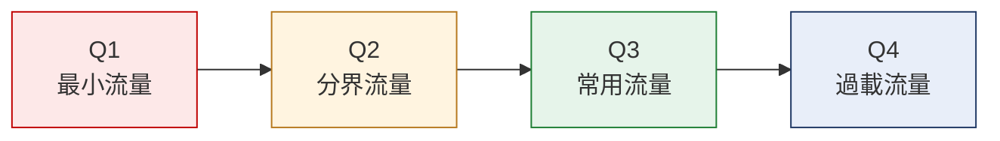
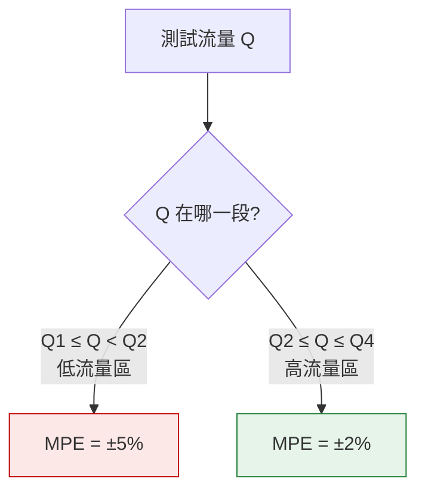
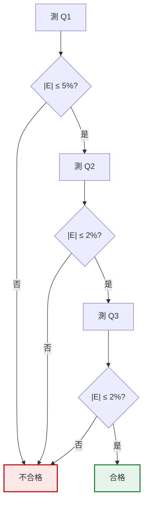

# 流量點與誤差限
{: .no_toc }

  
本頁目錄

  {: .text-delta }
- TOC
{:toc}

{: .warning }
本頁以 **ISO 4064 / OIML R49** 的架構說明觀念。
實際適用的流量值、誤差限、測試點數,一律以**該型號的型式認證文件與現行國家標準**為準。

## 為什麼不是測一次就好

流量計不是線性的。同一支表在**大流量**和**小流量**下的表現差很多:

- 大流量:水衝力足,葉輪轉得順,誤差小
- 小流量:摩擦力、軸承阻力的相對影響變大,容易**轉不動或轉太慢**,誤差往負的方向跑

所以只測一個點完全無法代表整支表。標準規定要在**涵蓋使用範圍的數個流量點**分別測。

## 四個流量點

| 符號 | 名稱 | 意思 |
|:--|:--|:--|
| **Q1** | 最小流量 | 表還必須維持在誤差限內的**最小**流量 |
| **Q2** | 分界流量 | Q1 與 Q3 之間的分界。**誤差限在這裡換檔** |
| **Q3** | 常用流量 | 正常使用條件下的參考流量,**規格上標示的就是它** |
| **Q4** | 過載流量 | 短時間可承受的最大流量 |

### 它們之間的關係

ISO 4064:2014 的定義:

- **Q2 = 1.6 × Q1**
- **Q4 = 1.25 × Q3**
- **R = Q3 / Q1** ← 這個叫**量程比**

{: .example }
**R80** 的意思就是 **Q3 / Q1 = 80**。
R 值越大,代表這支表能準確計量的範圍越寬——小流量也量得準。
所以 R80 比 R40 等級高,也比較難做。

{: .note }
知道 Q3 和 R,其他三個點就都算得出來:
`Q1 = Q3 / R`、`Q2 = 1.6 × Q1`、`Q4 = 1.25 × Q3`。
新人常見的困惑是「為什麼規格只寫 Q3 和 R」——因為其他點是推導出來的。

## 誤差限(MPE)分兩段

| 流量區間 | 最大允許誤差 |
|:--|:--|
| Q1 ≤ Q < Q2(低區) | **±5%** |
| Q2 ≤ Q ≤ Q4(高區) | **±2%** |

{: .warning }
上表是常溫水(T30)一般情況的值。高溫水錶或不同準確度等級的限值不同,
**以該型號的型式認證為準**。

### 為什麼低流量區比較寬

因為物理上就是比較難。小流量時葉輪的啟動阻力、軸承摩擦佔的比例大,做不到 ±2%。標準承認這個現實,所以在 Q2 以下放寬到 ±5%。

**Q2 就是換檔的那條線。** 這也是為什麼 Q2 常常是最難過的點——它在誤差限**剛剛收緊**的位置。

{: .important }
**「限值最緊」和「最容易超出」是兩件事。**
最容易被卡住的點,通常是**限值剛收緊、而性能還沒完全穩定**的那個交界處,也就是 Q2 附近。
不是誤差最大的點,是「餘裕最少」的點。

## 誤差怎麼算

$$
E(\%) = \frac{V_{\text{表指示}} - V_{\text{標準}}}{V_{\text{標準}}} \times 100\%
$$

**分母永遠是標準器的值**,不是表的值。這是新人最常算反的地方。

{: .example }
標準器量到 **100.00 L**,水錶顯示 **98.50 L**:
`E = (98.50 - 100.00) / 100.00 × 100% = -1.50%`
負號代表**表走得慢**(少計了),正號代表**表走得快**(多計了)。

### 正負號的意義

| 符號 | 意思 | 對誰不利 |
|:--|:--|:--|
| **正誤差(+)** | 表多計了,用戶被多收費 | 用戶 |
| **負誤差(−)** | 表少計了,水公司少收費 | 供水單位 |

兩邊都不允許超限。法規對兩個方向是對稱的(±)。

## 判定

**每一個流量點都要在該點的誤差限內。任何一點超出就是整支不合格。**

不能平均、不能互相折抵。Q1 過得很漂亮不能補償 Q2 超出。

## 常見錯誤

**誤差算反(分母用了表的值)。**
數字會很接近但不對,而且越接近限值時差異越關鍵。

**用錯誤差限。**
在 Q1 點套用 ±2%,或在 Q3 點套用 ±5%。**先確認這個流量落在哪一區,再查限值。**

**流量點沒對準。**
測試時實際流量偏離目標值太多,測的就不是那個點了。標準對每個測試點的流量容許範圍有規定。

**用平均值判定。**
三個點分別是 -4.8%、-1.9%、-0.5%,平均起來看似不錯,但 Q1 的 -4.8% 已經逼近 5% 限值,而且**判定本來就是逐點判**。

**忘記量測不確定度。**
量到 -1.98%,限值 ±2%,判合格——但如果試驗台的不確定度是 ±0.3%,真值可能已經超出。**貼著限值的結果要複測**。

## 你應該要會

- [ ] 說出 Q1/Q2/Q3/Q4 各是什麼,以及它們的換算關係
- [ ] 由 Q3 和 R 算出 Q1、Q2、Q4
- [ ] 說出兩段誤差限的分界在哪、為什麼低區比較寬
- [ ] 正確計算誤差百分比(分母是標準值)
- [ ] 解釋正負誤差分別對誰不利
- [ ] 說明為什麼各點要分別判、不能平均
